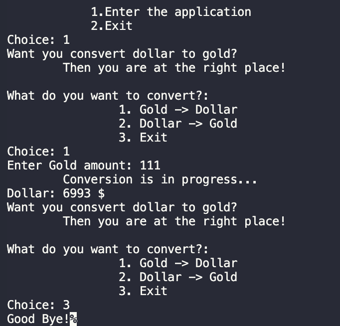

# Doviz
- ### This development will help you convert the dollar to gold.
  
`Formula:`
```C#
double money = double.Parse(Console.ReadLine()!);
double convertToGold = money * "gold price today";
```
`Functions:`
```C#
Output to console: Console.WriteLine();
Input from console: Console.Readline();
Converts: double.Parse();
```
`Types:`
```C#
double & string 
```
`Demo:`



### You can take my code and try it yourself !

1.About the list of files,click <> Code.


2.Copy the URL(HTTPS) of the repository.


3.Open terminal.

4.Change the current working catalogue ti the location where the cloned catalogur should be located.

5.Type "***git clone***" and paste the URL copied earlier.


6.Press enter to create a local clone.


To see other projects click **[HERE](https://github.com/ZafarUrakov)**.

